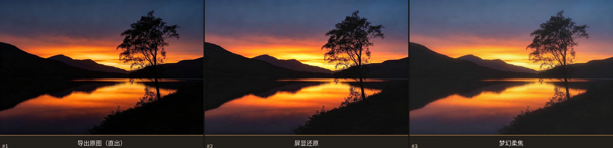

# Canon助手 相机屏显还原

把佳能相机屏幕上的惊艳，还原到导出的照片上。

很多摄影师都有同感：相机 LCD 上回放照片时惊艳无比，导出到电脑后却变灰、变暗、变平淡。
**Canon助手** 是一个运行在飞牛 fnOS 上的**原生应用**（不需要 Docker），用 Go 编写，
通过一套"相机屏幕观感"的处理管线，一键把导出的 JPG 还原成拍摄时屏幕上的样子，
并内置梦幻柔焦、日系清新、复古胶片等十款滤镜。

> 效果对比（左：导出原图 · 中：屏显还原 · 右：梦幻柔焦）
>
> 

当前版本：**0.1.7**

---

## 为什么相机屏幕看起来更好看？

这不是错觉，主要有三个原因：

1. **LCD 屏幕特性**：相机屏幕很小、背光很亮、色彩调教偏鲜艳讨喜，且高光/阴影的动态范围表现与实际照片不同；
2. **机内预览处理**：回放时相机会套用 Picture Style（标准/风景/人像等）和自动亮度优化来显示预览，导出 JPG 时这些"讨好"处理会被弱化；
3. **观看环境**：室内电脑屏幕的亮度、色温与户外拍摄时的相机屏幕差异巨大。

Canon助手 的"相机屏显还原"预设针对性地模拟了这种观感：**轻微提亮（模拟背光）、S 型对比增强、饱和度提升、局部清晰度增强**，并在高光处保持克制、不过曝。

## 功能特性

- **一键屏显还原**：默认预设即为"相机屏显还原"，上传即预览效果；
- **双图并排对比**：原图与还原效果左右并排实时对比（手机端上下堆叠），所见即所得（前端 Canvas 与服务端 Go 使用**完全相同的算法**）；
- **十款风格滤镜**：相机屏显还原 / 梦幻柔焦 / 日系清新 / 复古胶片 / 风光鲜亮 / 人像柔肤 / 黄昏暖阳 / 电影感 / 经典黑白 / 清晨薄雾；
- **十项精细调节**：亮度、对比度、饱和度（支持去色到纯黑白）、鲜艳度、色温、清晰度、梦幻柔焦、胶片褪色、颗粒、暗角；
- **原图分辨率导出**：预览用降采样图保证流畅，下载时服务端按原图全分辨率渲染（JPEG 质量 95）；
- **EXIF 元数据保留**：输出照片保留原始拍摄参数（机型、镜头、拍摄时间、GPS 等），EXIF 方向自动重置，避免二次旋转；
- **批量处理**：把照片放进共享目录 `canonrevive/in`，一键批量输出到 `canonrevive/out`；
- **EXIF 方向自动纠正**：竖拍照片不再躺倒；
- **隐私友好**：照片只在本地 NAS 处理，不上传任何服务器。

## 安装

### 从 GitHub 下载（推荐）

前往 [GitHub Releases](https://github.com/suytool/canonrevive/releases) 下载最新版 fpk 安装包：

- `canonrevive.fpk` —— x86_64（Intel / AMD 飞牛）
- `canonrevive.arm64.fpk` —— ARM64（飞牛 ARM 版）
- `CanonHelper-fpk-v0.1.7.zip` —— 双架构合集

然后到飞牛应用中心 → **手动安装** → 上传 fpk 文件（离线安装）：

| 架构 | 文件 |
|---|---|
| x86_64（Intel / AMD） | `canonrevive.fpk` |
| ARM64（aarch64） | `canonrevive.arm64.fpk` |

安装完成后，桌面会出现 **Canon助手 屏显还原** 图标，点击即可在浏览器中打开。

- 默认端口：`18080`（安装时可改）
- 安装向导会自动创建共享目录 `canonrevive`（含 `canonrevive/in`、`canonrevive/out`）

## 使用

### 单张精修

1. 打开应用，拖入或选择一张照片（JPG/PNG，≤64MB）；
2. 默认已应用"相机屏显还原"，左侧原图、右侧还原效果实时对比；
3. 可选滤镜、拖动滑杆微调；
4. 点击 **下载还原后的照片**，得到按原图分辨率渲染的结果。

### 批量处理

1. 在文件管理器中把照片复制到飞牛的 `canonrevive/in` 目录（应用的共享目录）；
2. 打开应用，点击"开始批量处理"；
3. 处理结果输出到 `canonrevive/out`，文件名追加 `_restored`。

## 滤镜与参数

| 预设 | 效果 |
|---|---|
| 相机屏显还原 | 提亮 +16、对比 +24、饱和 +30、鲜艳 +14、清晰 +14 —— 模拟 LCD 观感，效果明显 |
| 梦幻柔焦 | 柔光 Screen 混合 + 轻微暗角，光晕梦幻 |
| 日系清新 | 高亮度、低饱和、偏冷、轻微褪色 |
| 复古胶片 | 黑场提升、暖调、颗粒、暗角 |
| 风光鲜亮 | 高对比高饱和、清晰通透 |
| 人像柔肤 | 轻微柔光、肤色偏暖、降低刺眼细节 |
| 黄昏暖阳 | 暖调浸染 + 暗角收拢，日落氛围感 |
| 电影感 | 冷调青灰、强对比、颗粒与暗角，宽银幕质感 |
| 经典黑白 | 完全去色、强对比、颗粒与暗角，银盐黑白 |
| 清晨薄雾 | 提亮、低对比、微冷、淡淡柔光，空气感 |

十项滑杆的范围与含义：

| 参数 | 范围 | 说明 |
|---|---|---|
| 亮度 | -50 ~ 50 | 加法提亮，模拟 LCD 背光，黑场同步抬起 |
| 对比度 | -50 ~ 50 | 围绕中灰 128 缩放（S 型感） |
| 饱和度 | -100 ~ 50 | YCbCr 色度缩放（拉到 -100 即经典黑白） |
| 鲜艳度 | 0 ~ 50 | 优先增强低饱和区域，保护肤色 |
| 色温 | -30 ~ 30 | >0 偏暖，<0 偏冷 |
| 清晰度 | -30 ~ 30 | 局部对比度（unsharp mask） |
| 梦幻柔焦 | 0 ~ 100 | 高斯模糊 + Screen 混合 |
| 胶片褪色 | 0 ~ 100 | 黑场提升（fade） |
| 颗粒 | 0 ~ 100 | 确定性噪声，重绘不闪烁 |
| 暗角 | 0 ~ 100 | 径向压暗 |

## 项目结构

```
canonrevive/
├── main.go                  # 入口：HTTP 服务、环境变量
├── internal/
│   ├── imageproc/
│   │   ├── params.go        # 参数与六款预设定义
│   │   ├── process.go       # 处理管线（清晰度→基础色→柔焦→褪色/颗粒/暗角）
│   │   └── process_test.go  # 单元测试
│   └── server/
│       ├── server.go        # HTTP API：upload / preview / render / batch / presets
│       ├── exif.go          # EXIF 保留：APP1 提取、Orientation 重置、插回
│       └── web/             # 内嵌前端（index.html / app.js / style.css）
├── fpk/                     # fpk 工程源码（fnpack 打包目录）
│   ├── manifest             # 应用元信息
│   ├── ICON.PNG / ICON_256.PNG
│   ├── config/privilege     # 权限声明（run-as package）
│   ├── config/resource      # 共享目录 canonrevive
│   ├── cmd/                 # 9 个生命周期脚本（main + install/uninstall/upgrade/config）
│   └── app/
│       ├── canonrevive      # Go 编译的静态二进制
│       └── ui/              # 桌面图标入口配置与图标
├── canonrevive.fpk        # x86_64 安装包（发布在 GitHub Releases）
├── canonrevive.arm64.fpk  # ARM64 安装包（发布在 GitHub Releases）
└── docs/
    └── 效果对比-原图-屏显还原-梦幻柔焦.jpg
```

## 本地开发与重新打包

```bash
# 编译（当前架构）
go build -ldflags="-s -w" -o fpk/app/canonrevive .

# 交叉编译 ARM64
CGO_ENABLED=0 GOOS=linux GOARCH=arm64 go build -ldflags="-s -w" -o fpk/app/canonrevive .

# 打包 fpk（manifest 中 arch 需与二进制架构一致）
fnpack build --directory fpk

# 本地直接运行（不打包）
PORT=18080 APP_DATA=./data APP_IN=./share/in APP_OUT=./share/out go run .
```

### 算法说明（前后端一致性）

前端 `app.js` 与后端 `process.go` 实现了**逐公式一致**的处理管线，保证预览即所得：

1. 清晰度（unsharp mask，半径随分辨率自适应）；
2. 基础色：对比度 → 亮度 → 饱和度/鲜艳度（YCbCr 空间，BT.601，与 Go 标准库一致）→ 色温；
3. 梦幻柔焦：缩小→模糊→放大→ Screen 混合（与后端 blurredLarge 等效）；
4. 胶片褪色（黑场提升）；
5. 颗粒（确定性坐标哈希噪声，避免预览闪烁）；
6. 暗角（径向二次方压暗）。

## 已知限制与故障排查

### 启动失败排查

应用中心的"启用"按钮如果报启动失败，错误弹窗会直接显示**真实原因**（如端口被占用、目录不可写等）。常见情况及处理：

| 弹窗提示 | 处理 |
|---|---|
| `bind: address already in use`（端口占用） | 应用设置里把端口改成其他未占用端口（如 18090） |
| `mkdir /volX/@appcenter/shares: permission denied` | 旧版本（≤0.0.1）的共享目录路径错误，请升级到 0.0.2+；如仍有此提示，卸载后重装 |
| 目录不可写 / Permission denied | 在应用设置中确认权限，或卸载重装 |
| 其他未知原因 | 在飞牛 SSH 终端查看应用日志：`cat /var/apps/canonrevive/var/info.log` |

详细日志记录在应用数据目录 `var/info.log`，包含启动参数、错误堆栈等信息。

### 已知限制

- 预览为**降采样图**（最长边 1600px，保证流畅），下载为原图分辨率全量渲染；两者算法一致（逐像素验证 PSNR > 39dB），但预览清晰度使用盒式模糊近似高斯的微小差异不可见；
- EXIF 中的 **XMP（Adobe）数据不会保留**，仅保留标准 Exif 段；EXIF 内嵌缩略图随原段保留，与重新编码后的画面可能有细微差异；
- 只支持 JPG/JPEG/PNG 输入；
- 处理在 CPU 上进行，高分辨率大图（如 6000×4000）单张处理约 1~3 秒，属正常范围；
- 卸载应用时，`canonrevive` 共享目录中的照片会被保留（防误删设计），如不需要可手动清理。

## 免责声明

本应用为社区开发的开源工具，与佳能公司无任何关联。"相机屏显还原"为观感模拟，不同机型、屏幕设置下效果略有差异，建议以实际预览为准。
